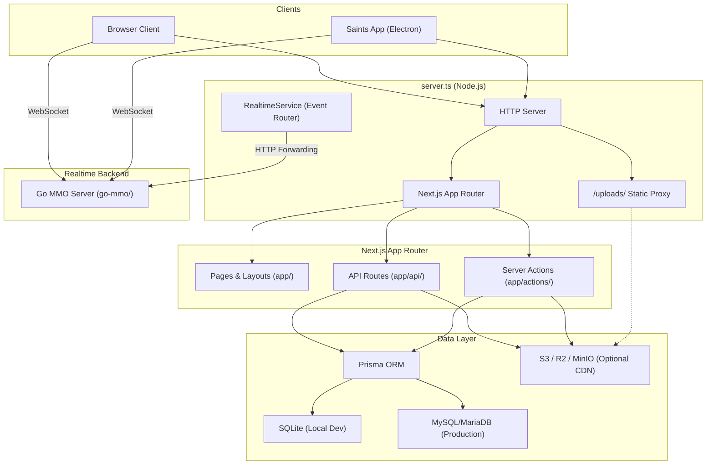

# Saints Gaming — Architecture Overview

> **Saints Gaming: Time To Play** — A community-driven gaming platform built on Next.js, featuring a browser-based MMO game engine, a real-time Studio world editor, social media feeds, forums, and more.

---

## High-Level System Diagram



---

## Core Architecture

### 1. Entry Point: `server.ts`

The custom Node.js HTTP server wraps the Next.js App Router and adds three responsibilities:

| Responsibility | Details |
|---|---|
| **Static Upload Proxy** | Intercepts `/uploads/*` requests and streams files from `public/uploads/` with proper MIME types, HTTP 206 range support, and CORS headers. This bypasses Next.js's static file caching which only snapshots `public/` at build time. |
| **Server Status Endpoint** | Fast-path `/api/game/server-status` returns live player counts without hitting Next.js middleware. |
| **Realtime Event Router** | Instantiates `RealtimeService` which forwards lobby, Studio, and game events to the Go MMO backend via HTTP. |

### 2. Next.js App Router (`app/`)

Saints Gaming uses **Next.js App Router** with route groups:

| Route Group | Purpose |
|---|---|
| `app/(main)/` | Public-facing site: forums, feeds, profiles, news, admin panel |
| `app/(ucp)/` | User Control Panel: account settings, notifications |
| `app/api/` | REST API endpoints (maps, auth, Discord bridge, FiveM bridge) |
| `app/actions/` | Server Actions (Prisma mutations, S3 uploads, Studio operations) |

### 3. Source Code Organization (`src/`)

The `src/` directory enforces a strict **isomorphic boundary**:

```
src/
├── shared/          # Isomorphic: Game logic, types, constants
│   ├── game/        # Game engine math, tile helpers, combat formulas
│   ├── types/       # Shared TypeScript interfaces
│   └── constants/   # Game balance values, enums
├── web/             # Browser-only: React components, hooks, stores
│   ├── components/  # UI components (Shadcn + custom)
│   │   ├── ui/      # Shadcn primitives (Button, Dialog, etc.)
│   │   ├── shared/  # Reusable app components (Navbar, Footer, etc.)
│   │   ├── the-lobby/  # Game client & Studio editor
│   │   └── messenger/  # Real-time chat system
│   ├── hooks/       # React hooks (auth, game data, debounce)
│   ├── stores/      # Zustand state management (useAppStore)
│   └── lib/         # Browser-side utilities (uploads, S3, auth)
├── server/          # Server-only: Realtime service, media pipeline
│   ├── realtime/    # RealtimeService (Go MMO event forwarding)
│   └── media/       # Video processing pipeline (ffmpeg)
└── engine/          # Game rendering engine (Babylon.js, voxel system)
```

**Rule**: `src/shared/` must NEVER import from `src/web/`, `src/server/`, or `src/engine/`. It is the foundation layer that all other modules depend on.

### 4. Database Layer (Prisma)

Saints Gaming uses **Prisma ORM** with a dynamic schema adaptation system:

- **`prisma/schema.prisma`** — The single source of truth for the database schema.
- **`scripts/prepare-prisma.js`** — A build-time script that automatically rewrites `schema.prisma` based on the `DATABASE_URL` in `.env`:
  - **SQLite** (`file:./prisma/db/dev.db`): Strips `@db.Text` and `@db.LongText` annotations.
  - **MySQL** (`mysql://...`): Injects `@db.Text` and `@db.LongText` annotations for large text columns.

This allows developers to use zero-config local SQLite for development while deploying to MySQL/MariaDB in production, all from a single schema file.

### 5. Uploads & Storage

| Mode | When Active | Behavior |
|---|---|---|
| **Local Disk** | Default (no S3 env vars) | Files saved to `public/uploads/`, served by `server.ts` upload proxy |
| **S3-Compatible** | `S3_BUCKET` + `CDN_BASE_URL` set | Files uploaded to S3/R2/MinIO, URLs rewritten to CDN base |

- `src/web/lib/upload.ts` — Upload logic with magic-byte validation, MIME inference, and S3 fallback.
- `src/web/lib/s3-storage.ts` — S3 client wrapper (PutObject, DeleteObject).
- `scripts/migrate-local-uploads-to-s3.ts` — One-time migration script for existing local files.

### 6. Realtime & Game Server

Saints Gaming supports two realtime backends:

| Backend | Role | Configuration |
|---|---|---|
| **Go MMO** (`go-mmo/`) | Primary game server: lobby sockets, movement, combat, Studio collaboration | `NEXT_PUBLIC_GO_MMO_URL` in `.env` |
| **Node.js Fallback** (`src/server/`) | Event router; forwards events to Go. Can run standalone TS game engine if `ENABLE_TS_GAME_ENGINE=1` | Default when Go URL is not set |

The Node.js `RealtimeService` acts as a **bridge**, not a replacement. Clients connect WebSocket directly to the Go MMO server for game state, while Next.js API routes handle persistence (map save/load, character data) via Prisma.

### 7. Saints App (Electron Desktop Client)

The `saints-app/` directory contains an **Electron wrapper** that provides performance benefits for the game engine and Studio:

| Feature | Benefit |
|---|---|
| **Hardware-accelerated GPU** | Direct Chromium GPU access for Babylon.js rendering without browser sandbox overhead |
| **Deep Link Protocol** | `saints-gaming://` URI scheme for launching directly into lobbies or Studio sessions |
| **Local File Access** | Native filesystem access for asset management and offline caching |
| **Single Instance Lock** | Prevents duplicate app windows, forwards deep links to active instance |

The Electron client connects to the same `server.ts` HTTP endpoint as browsers — it is a **thin performance shell**, not a separate application.

---

## Test Infrastructure

| Suite | Location | Runner | Purpose |
|---|---|---|---|
| **Unit Tests** | `src/**/*.test.ts` | Vitest | Game logic, utilities, pure functions |
| **E2E Tests** | `test/e2e/*.test.ts` | Vitest (Node env) | Socket connections, lobby flows, Studio map save/load |
| **Validation Scripts** | `scripts/validate-*.ts` | tsx | Hook and map data integrity checks |

Run all tests: `npm run test`  
Run E2E only: `npm run test:e2e`

---

## Key Environment Variables

| Variable | Purpose |
|---|---|
| `DATABASE_URL` | Prisma connection string (SQLite or MySQL) |
| `AUTH_SECRET` | NextAuth session encryption |
| `NEXT_PUBLIC_GO_MMO_URL` | Go MMO server WebSocket endpoint |
| `S3_BUCKET` + `CDN_BASE_URL` | Enable S3 upload storage |
| `GEMINI_API_KEY` | AI text enhancement in forum editor |
| `AUTH_DISCORD_ID` / `AUTH_DISCORD_SECRET` | Discord OAuth login |
